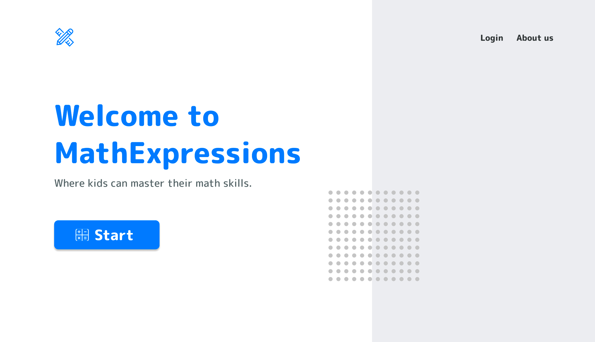
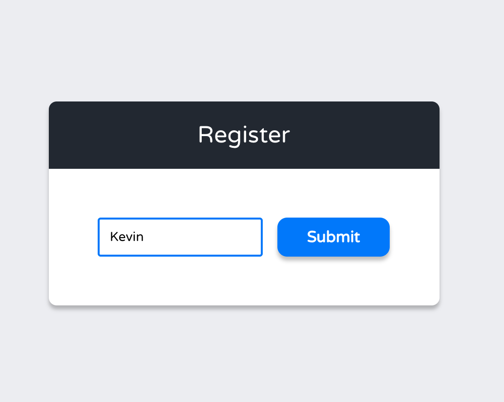
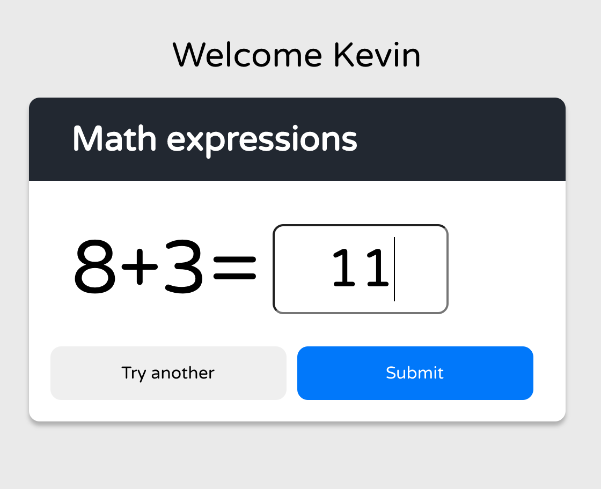

# Planning

Step 1: <br>
Create mockups using Figma for UI. Example:<br>

**Home** <br>


**Register** <br>


**Exercise** <br>


Step 2: <br>
[LogoMakr](https://logomakr.com/) was used to create the logo of this website.

Step 3: <br>
**Some code considerations**

- This web application is coded following some programming advices from "Clean Code: A Handbook of Agile Software Craftsmanship" by Robert C. Martin to have a cleaner code such as keeping small functions that define their own functionality thanks to how they were named.

- Locale storage was used to simulate a backend functionality for authentification.

# Ideas for new Ffeatures

- Maintaining a history of questions
  A function with one parameter can be create in App.js file to push every new questions in an array and pass down that function into ``<Expressions />`` component as a prop, for example:

```javascript
const [questionHistory, setQuestionHistory] = useState([]);
const handleQuestionHistory = (newQuestion) => {
    setQuestionHistory(question.push(newQuestion))
};
```
